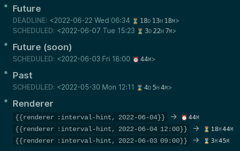
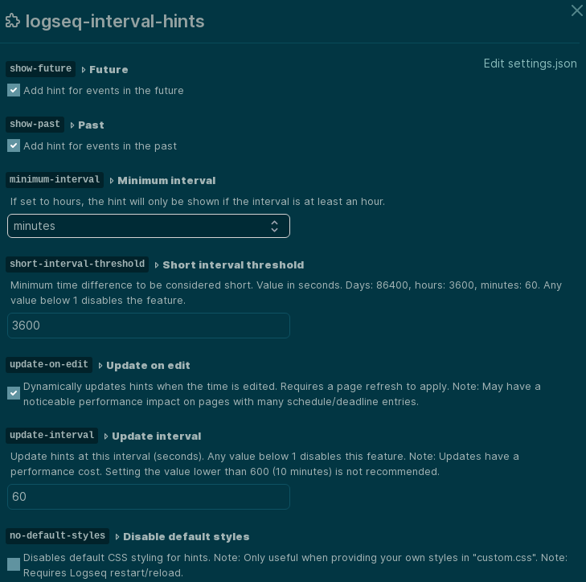

# Interval Hints

## Synopsis

Configurable [Logseq](https://www.logseq.com/) plugin to annotate deadline and scheduled times
with a countdown or interval.


## Features

* Block renderer to add countdowns/elapsed time anywhere.
* Configure adding hints for future and past events.
* Hide hints below a minimum interval.
* Can emphasize hints when the interval is short.
* Can update hints when the schedule or deadline is changed.
* Can update hints periodically.
* Hints can be styled with CSS.


## Installation

1. **(Recommended)** Install from the plugin marketplace. Search for `interval hints`.
2. Turn on developer mode in settings and load this repo as an "unpacked plugin" from the Logseq plugins page (`t p`).


## Screenshots

**Note**: May not reflect all features/changes in the current version.

#### In use



#### Settings




## Styles

To be used in `custom.css` which is editable from the Logseq settings (`t s` default bind).

When using complex styles it may be useful to use the `no-default-styles` option in the plugin settings and just use a modified
version of the default style in `custom.css`.


**Note**: All classes listed start with `lsp-interval-hints`.

CSS Class|Description
-|-
` `|Container element for hints.
`-future`|Applied to container when time is in the future.
`-past`|Applied to container when time is in the past.
`-short`|Applied to container when duration is considered short.
`-renderer`|Applied to container for renderer hints.
`-label`|Applied to child element for label (⏳, ⌛, etc)
`-y`|Applied to child element containing number of years.
`-o`|As above, but for months.
`-d`|As above, but for days.
`-h`|As above, but for hours.
`-m`|As above, but for minutes.
`-s`|As above, but for seconds.

In addition to the above, the class `hidden` (without the `lsp-interval-hints`) prefix is used for hints that are hidden. Hints
may be hidden if they are below the minimum duration or based on the `show-future`/`show-past` settings.

### Default

```css
.lsp-interval-hints { margin-left: 0.25em; padding-left: 0px; font-family: monospace; }

.lsp-interval-hints-future > .lsp-interval-hints-label::before { content: '⏳'; }
.lsp-interval-hints-future.lsp-interval-hints-short > .lsp-interval-hints-label::before { content: '⏰'; }
.lsp-interval-hints-past > .lsp-interval-hints-label::before { content: '⌛'; }

.lsp-interval-hints > * { color: var(--ls-secondary-text-color); }
.lsp-interval-hints > ::after ,
.lsp-interval-hints > ::before { color: var(--ls-page-inline-code-color); font-size: 0.8em; }
.lsp-interval-hints > :not(:last-child)::after ,
.lsp-interval-hints > :not(:last-child)::before { padding-right: .2em; }
.lsp-interval-hints-y::after { content: 'Y'; }
.lsp-interval-hints-o::after { content: 'MO'; }
.lsp-interval-hints-d::after { content: 'D'; }
.lsp-interval-hints-h::after { content: 'H'; }
.lsp-interval-hints-m::after { content: 'M'; }
.lsp-interval-hints-s::after { content: 'S'; }
```

### Interval type position

Moves the interval type (hour, minutes, etc) before the number. This example also changes it to lowercase.

```css
.lsp-interval-hints-y::after , .lsp-interval-hints-o::after ,
.lsp-interval-hints-d::after , .lsp-interval-hints-h::after ,
.lsp-interval-hints-m::after , .lsp-interval-hints-s::after { all: revert !important; }
.lsp-interval-hints-y::after { content: 'y' !important; }
.lsp-interval-hints-o::after { content: 'mo' !important; }
.lsp-interval-hints-d::before { content: 'd' !important; }
.lsp-interval-hints-h::before { content: 'h' !important; }
.lsp-interval-hints-m::before { content: 'm' !important; }
.lsp-interval-hints-s::before { content: 's' !important; }
```

### Bracket hint

Surrounds the hint with fancy brackets.

```css
.lsp-interval-hints::before { content: '«'; padding-left: .5em; }
.lsp-interval-hints::after { content: '»'; }
```

### Hide for done/cancelled

Hides hints for done or cancelled items. This only works for TODOs and not all scheduled/deadline items.

**Note**: May have a performance impact due to the complex CSS rules.

```css
.ls-block[data-refs-self*='"done"'] .lsp-interval-hints ,
.ls-block[data-refs-self*='"cancelled"'] .lsp-interval-hints { display: none !important; }
```

## Known issues/limitations

1. May have date/time parsing issues if `time` elements generated by Logseq aren't in the expected format (`2022-06-01 Wed 13:00:00`). I don't know if the format can vary based on locale.
2. Uses complex CSS rules for styling hints which may have a noticeable performance impact.


## Credit

Initial inspiration was the [logseq-deadline-countdown](https://github.com/xxchan/logseq-deadline-countdown) by xxchan.

For anyone that doesn't need the renderer, automatic updating or styling options this plugin provides and is looking for something lighter I would recommend considering `logseq-deadline-countdown`.
